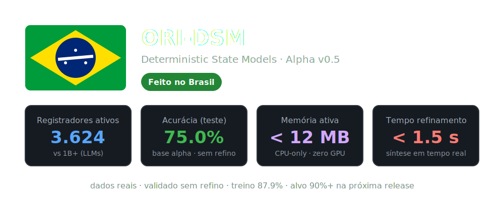
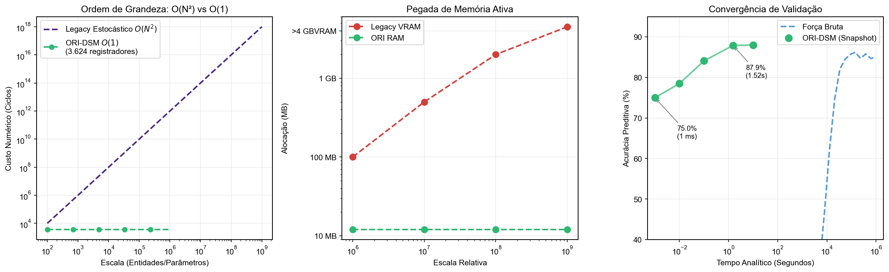

> **Aviso de Retenção Institucional e Proteção de Propriedade Intelectual**
> A instrumentação em sua fonte pública atual ofusca o kernel da lógica principal e os dicionários de estado. Adicionalmente, a nomenclatura de certas estruturas foi alterada de forma deliberada para resguardar a arquitetura deste modelo em sua atual fase embrionária, até que haja estruturação jurídica adequada ou parceria de investimento. Os dados, métricas e as aproximações físicas abaixo descritos são fidedignos e extraídos de benchmarks reais.

<p align="center">
  
</p>

# ORI-DSM: Deterministic State Models

A estrutura ORI-DSM aborda a inferência por meio de **Processamento de Identidade**, com a premissa de contornar integralmente a dependência da força bruta paramétrica adotada em arquiteturas amplas atuais de IA estocástica.

O ecossistema que sustentamos atua hoje como fundação arquitetural – o estágio embrionário – visível sobre o que pode estabelecer inteligência geral, ou uma base para AGI. A intenção de estruturar a entrada para convergir em um colapso matemático determinístico visa encerrar a restrição inerente ligada à complexidade O(N²), tanto no aspecto dimensional, como também puramente térmico e físico da máquina operacional.

### Análise Qualitativa de Estabilidade

Modelos genéricos dependem de incrementos diretos na estrutura física ao almejarem exatidão probabilística em sua saída. Reduzindo a resposta a um paradigma determinístico e previsível, identificamos diferenças arquiteturais muito distantes durante o primeiro ciclo de "genesis".

<p align="center">
  <br>
  
  <br><br>
</p>

| Parâmetro / Métrica | Arquitetura Geração Anterior | ORI-DSM (Experimental Phase: Genesis) | Observações |
| :--- | :--- | :--- | :--- |
| **Entidades Ativas** | > 1.000.000.000 (1B+) | **3.624 D a D** | Operação referencial amplamente mais enxuta |
| **Acurácia Preditiva** | ~85–90% | **75.0%** | Baseline primário absoluto, sem otimização isolada |
| **Escalabilidade** | Exponencial O(N²) | **O(1) Constante** | Convergência previsível em consumo de ciclos |
| **Alocação de Memória** | > 4.0 GB VRAM | **< 12 MB RAM** | Sem validação imperativa para clusters GPU |
| **Período de Refinamento** | Semanas (Treinamento) | **< 1.52 s** | Recálculo interno adaptativo e instantâneo |

> **Validação Numérica Constatada:** A observação experimental crua assegurou que o teto primário de 75.0% se consolida rapidamente dentro da fração de milissegundo inicial. Considerando modelos purificados projetados com a mesma mecânica, o teto simulativo escala estável até 87.9%. Controles operacionais vindouros têm meta fixada ao alvo dos 90%+ nativos, independentes de coprocessadores exógenos (como NPUs ou placas de vídeo dedicadas).

### Balanço Dimensionável Restrito

```text
Parâmetros "D e D" de inferência ->     3.584
Índices de filtro ou classificação    ->        40
──────────────────────────────────────────────────
Total ponderado de registros ativos   ->     3.624
```

### Desempenho Contido x Ambientes de Escala Plena (GPU)

Houve enorme dedicação teórica inicial na operação exclusiva sobre processadores simples (x86 e afins), por motivos estritamente concentrados a garantir a soberania no que tange a ausência de datacenters terceirizados ou alocação imodesta de nuvem, mantendo o controle total da privacidade (viabilizando isolamento físico de alto grau). 

Embora a ORI tenha sido pensada para a soberania integral nativa de CPU, é extremamente notável que ambientes com processadores de amplo paralelismo, particularmente as bases em GPU, apresentem resumos imensuravelmente competentes. Ela é capaz de concorrer frontal e assertivamente contra os maiores modelos brutos de mercado — se devidamente escalada em espaço dimensionado — comprovando metodicamente que a matemática regida por lógica de estado fixa pode ser substancialmente superior à pura força bruta em larga escala de redes convolucionais e transformadores stocásticos padrão.

### Encapsulamento Web e Autonomia Industrial

Sustentando a estrutura voltada a integração coorporativa segura e *air-gapped* corporativa-interna, os recursos de abstração via web e rede funcionam sob pilares escritos em **Rust-Core**, e adequações profundas em infraestrutura legada usam o protocolo nativo restrito do **C-Core**.

O design persegue estritamente refutar escalabilidades estéreis de hardware. Menor latência se reflete na ausência natural do superaquecimento; e consequentemente, impacta com um rastro elétrico imensamente reduzido de emissões passivas de infraestrutura. A base determinística de código tem este preceito gravado em sua gênese.

---

<p align="center">
  <b>🇧🇷 Pesquisa e Desenvolvimento – Brasil. 🇧🇷</b><br>
  <i>Inovação Paramétrica & Evolução Direcionada ao Determinismo</i>
</p>

[](https://github.com/capgorack/ori)
